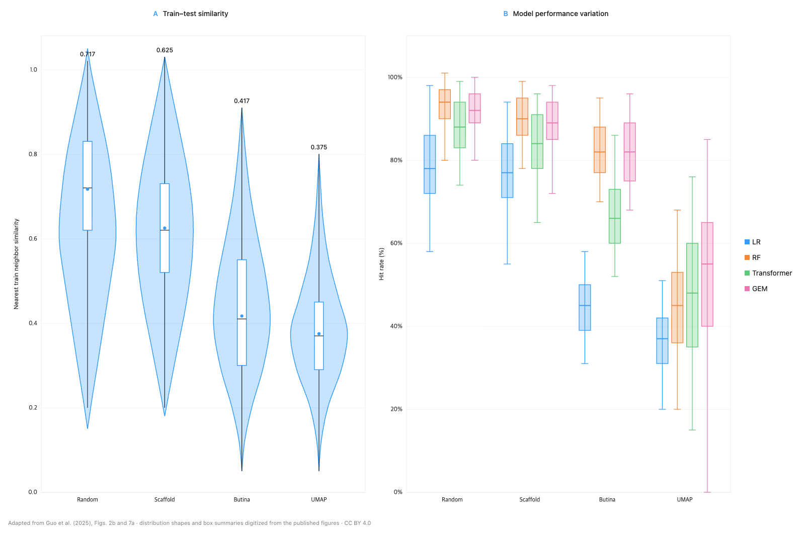

# bioml-data

> Reproducible data protocols for trustworthy biological machine learning.

`bioml-data` is an early-stage, open-source toolkit for turning public
biological datasets into auditable, ML-ready benchmarks. The project focuses on
the parts that are easy to get subtly wrong: provenance, preprocessing,
leakage-aware splitting, and comparable evaluation.

## Why this project

Public biological datasets are often available but not reproducible as machine
learning benchmarks. Researchers still have to reconstruct download logic,
metadata joins, filtering choices, task definitions, split rules, and metrics.
Those choices can materially change a result, especially when biological
relatedness or experimental batches leak across train and test sets.

Published evidence suggests that split design can materially change apparent biological ML performance: when pathology tiles from the same subject cross train/test boundaries, scores can be inflated by up to 41% ([Bussola et al.](https://arxiv.org/abs/1909.06539)); PPI models can perform near random under dissimilar-proteome partitions ([Bernett et al.](https://pmc.ncbi.nlm.nih.gov/articles/PMC10939362/)); and on an NCI-60 benchmark, Transformer-CNN hit rate was 67.67% with random splitting versus 33.27% with UMAP-based splitting ([Guo et al.](https://pmc.ncbi.nlm.nih.gov/articles/PMC12153141/)). These magnitudes and even the direction of change are task- and dataset-dependent, and a harder split may represent the intended distribution shift rather than leakage alone; this is why the project treats split choice and post-split audits as first-class protocol decisions.



*Redrawn from [Guo et al. (2025), Figures 2b and 7a](https://doi.org/10.1186/s13321-025-01039-8). Distribution shapes and box-plot summaries were digitized from the published figures. The source article is licensed under [CC BY 4.0](https://creativecommons.org/licenses/by/4.0/).*

The intended workflow is:

```text
load → dataset audit → select task → task audit → prepare
     → split → train-fitted preprocessing → split audit → evaluate
```

The core artifact is therefore not a hosted copy of the raw data. It is a
versioned protocol that records how a source dataset became a benchmark.

## Initial direction

Single-cell data is the first major modality we plan to validate because it is
prominent in current biological ML research and exposes the product's hardest
requirements early: study and donor boundaries, batch effects, sparse matrices,
metadata quality, and preprocessing choices that must be fitted on training data
only.

Two initial use cases have different roles:

- **Cell-type annotation** is the technical canary for validating ingestion,
  schemas, study-aware splits, and evaluation.
- **Perturbation prediction** is the intended flagship benchmark because it
  better tests generalization across perturbations, cell contexts, and studies.

Protein sequence and other modalities remain candidates after the protocol
abstractions are stable. Modality priority is a research-backed product decision,
not a permanent restriction.

## Initial scope

- Versioned references to public source artifacts and their checksums
- Canonical dataset and task schemas
- Deterministic preparation protocols
- Leakage-aware split protocols and post-split audits
- Standard evaluation protocols with uncertainty where appropriate
- Python APIs, command-line workflows, metadata, and protocol documentation

## Non-goals for the first release

- Hosting or redistributing every source dataset
- Processing raw sequencing reads such as FASTQ files
- Reimplementing specialized ambient-RNA or doublet-detection algorithms
- Supporting every biological modality or task type at once
- Building dashboards, private registries, or enterprise deployment features

## Status

The repository now includes a narrow, fixture-scale TMS Aorta technical canary.
It exercises content-addressed artifact ingest, canonical loading,
train-independent preparation, explicit animal-held-out splitting, train-only
fitting, leakage auditing, and evaluation without downloading the large public
dataset during CI.

TMS Aorta's `animal-held-out-v1` split is a package-defined
`PRODUCT_PROTOCOL` with the `CANARY` role. It is not a literature reference,
recommended scientific split, model recommendation, or state-of-the-art claim.

## Quickstart

Reopen a previously verified content-addressed artifact and run the shared
Python pipeline:

```python
from pathlib import Path

import bioml_data as bio

artifact = bio.load_artifact_receipt(
    Path(".cache/sha256/ab/<full-sha256>/manifest.json")
)
dataset = bio.load_dataset("tms-aorta", artifact=artifact)
receipt = bio.run_tms_aorta_canary(
    artifact,
    split_protocol="animal-held-out-v1",
    seed=17,
)

assert receipt.artifact_identity == dataset.artifact.artifact_id
```

The shared runner follows the lifecycle
`load_dataset → train-independent prepare → explicit split → train-fitted apply
→ audit → evaluate`. The split protocol has no default: passing `None` raises
`MissingSplitProtocolError` before any fitted state is created.

Run the same pipeline from the command line:

```bash
uv run bioml-data \
  --artifact-manifest .cache/sha256/ab/<full-sha256>/manifest.json \
  --split-protocol animal-held-out-v1 \
  --seed 17
```

Both surfaces emit the same deterministic identity chain: artifact, split
assignment, preparation receipt, leakage-audit report, metric protocol, and
evaluation receipt identities. The CLI writes the receipt as JSON.

Generic HTTP retrieval is available through `download_artifact()`. Callers must
provide an `ArtifactRequest` containing a byte size and SHA-256 obtained from a
trusted upstream manifest or release. The package does not guess or manufacture
an upstream TMS checksum. Downloads are streamed through the same immutable
artifact cache and are published only after size and checksum verification.

See [the TMS Aorta dataset and protocol contract](docs/tms-aorta.md) for the
canary's exact role, split behavior, preparation parameters, audit coverage, and
current upstream-pin limitation.

See [core product decisions](docs/core-decisions.md) for the current conceptual
model and [development](docs/development.md) for local setup and quality checks.
